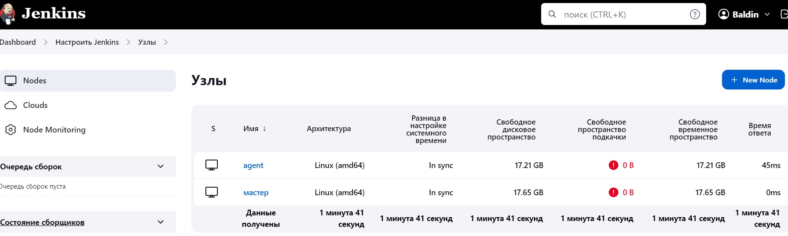
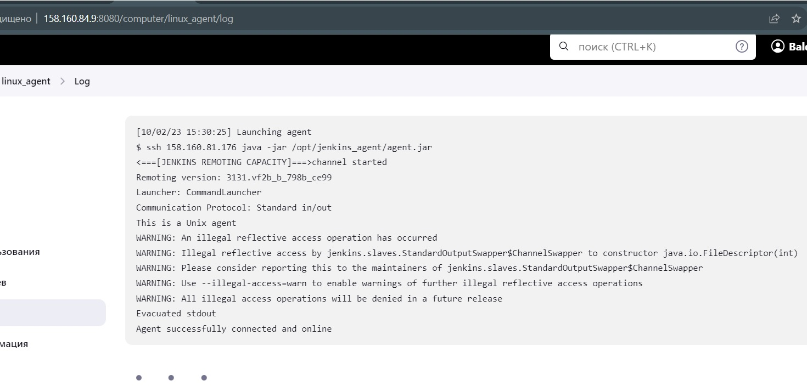

# Домашнее задание к занятию 10 «Jenkins»

## Подготовка к выполнению

1. Создать два VM: для jenkins-master и jenkins-agent.
2. Установить Jenkins при помощи playbook.
3. Запустить и проверить работоспособность.
4. Сделать первоначальную настройку.

**Установил Jenkins, прицепил агент:**




## Основная часть

1. Сделать Freestyle Job, который будет запускать `molecule test` из любого вашего репозитория с ролью.

*Для выполнения указал следующие команды:*

`pip3 install --user "molecule==3.5.2" "molecule_docker"`

`molecule --version`

`molecule test`

*и получаю такую ошибку:*

<details>

  <summary>ERROR</summary>

```console
Started by user Baldin
Running as SYSTEM
Building remotely on agent (linux ansible) in workspace /opt/jenkins_agent/workspace/fs_job
The recommended git tool is: NONE
No credentials specified
Cloning the remote Git repository
Cloning repository https://github.com/baldin-lex/vector_role.git
 > git init /opt/jenkins_agent/workspace/fs_job # timeout=10
Fetching upstream changes from https://github.com/baldin-lex/vector_role.git
 > git --version # timeout=10
 > git --version # 'git version 1.8.3.1'
 > git fetch --tags --progress https://github.com/baldin-lex/vector_role.git +refs/heads/*:refs/remotes/origin/* # timeout=10
 > git config remote.origin.url https://github.com/baldin-lex/vector_role.git # timeout=10
 > git config --add remote.origin.fetch +refs/heads/*:refs/remotes/origin/* # timeout=10
Avoid second fetch
 > git rev-parse refs/remotes/origin/main^{commit} # timeout=10
Checking out Revision 70fd4637e33551ceebd1d9d3cea9ac5484c3b7ff (refs/remotes/origin/main)
 > git config core.sparsecheckout # timeout=10
 > git checkout -f 70fd4637e33551ceebd1d9d3cea9ac5484c3b7ff # timeout=10
Commit message: "Delete alvistack_key"
First time build. Skipping changelog.
[fs_job] $ /bin/sh -xe /tmp/jenkins8446016371499156591.sh
+ pip3 install --user molecule==3.5.2 molecule_docker
Collecting molecule==3.5.2
  Downloading molecule-3.5.2-py3-none-any.whl (240 kB)
Collecting molecule_docker
  Downloading molecule_docker-1.1.0-py3-none-any.whl (16 kB)
Requirement already satisfied: Jinja2>=2.11.3 in /usr/local/lib/python3.6/site-packages (from molecule==3.5.2) (3.0.3)
Collecting dataclasses
  Downloading dataclasses-0.8-py3-none-any.whl (19 kB)
Collecting subprocess-tee>=0.3.5
  Downloading subprocess_tee-0.3.5-py3-none-any.whl (8.0 kB)
Collecting importlib-metadata
  Downloading importlib_metadata-4.8.3-py3-none-any.whl (17 kB)
Collecting ansible-compat>=0.5.0
  Downloading ansible_compat-1.0.0-py3-none-any.whl (16 kB)
Collecting pluggy<2.0,>=0.7.1
  Downloading pluggy-1.0.0-py2.py3-none-any.whl (13 kB)
Collecting cerberus!=1.3.3,!=1.3.4,>=1.3.1
  Downloading Cerberus-1.3.5-py3-none-any.whl (30 kB)
Requirement already satisfied: packaging in /usr/local/lib/python3.6/site-packages (from molecule==3.5.2) (21.3)
Collecting paramiko<3,>=2.5.0
  Downloading paramiko-2.12.0-py2.py3-none-any.whl (213 kB)
Requirement already satisfied: selinux in /usr/local/lib/python3.6/site-packages (from molecule==3.5.2) (0.2.1)
Collecting enrich>=1.2.5
  Downloading enrich-1.2.7-py3-none-any.whl (8.7 kB)
Collecting cookiecutter>=1.7.3
  Downloading cookiecutter-1.7.3-py2.py3-none-any.whl (34 kB)
Collecting click-help-colors>=0.9
  Downloading click_help_colors-0.9.4-py3-none-any.whl (6.4 kB)
Collecting PyYAML<6,>=5.1
  Downloading PyYAML-5.4.1-cp36-cp36m-manylinux1_x86_64.whl (640 kB)
Collecting rich>=9.5.1
  Downloading rich-12.6.0-py3-none-any.whl (237 kB)
Collecting click<9,>=8.0
  Downloading click-8.0.4-py3-none-any.whl (97 kB)
Collecting docker>=4.3.1
  Downloading docker-5.0.3-py2.py3-none-any.whl (146 kB)
Collecting requests
  Downloading requests-2.27.1-py2.py3-none-any.whl (63 kB)
Collecting cached-property~=1.5
  Downloading cached_property-1.5.2-py2.py3-none-any.whl (7.6 kB)
Collecting binaryornot>=0.4.4
  Downloading binaryornot-0.4.4-py2.py3-none-any.whl (9.0 kB)
Collecting six>=1.10
  Downloading six-1.16.0-py2.py3-none-any.whl (11 kB)
Collecting poyo>=0.5.0
  Downloading poyo-0.5.0-py2.py3-none-any.whl (10 kB)
Collecting jinja2-time>=0.2.0
  Downloading jinja2_time-0.2.0-py2.py3-none-any.whl (6.4 kB)
Collecting python-slugify>=4.0.0
  Downloading python_slugify-6.1.2-py2.py3-none-any.whl (9.4 kB)
Collecting websocket-client>=0.32.0
  Downloading websocket_client-1.3.1-py3-none-any.whl (54 kB)
Requirement already satisfied: MarkupSafe>=2.0 in /usr/local/lib64/python3.6/site-packages (from Jinja2>=2.11.3->molecule==3.5.2) (2.0.1)
Requirement already satisfied: cryptography>=2.5 in /usr/local/lib64/python3.6/site-packages (from paramiko<3,>=2.5.0->molecule==3.5.2) (40.0.2)
Collecting bcrypt>=3.1.3
  Downloading bcrypt-4.0.1-cp36-abi3-manylinux_2_17_x86_64.manylinux2014_x86_64.whl (593 kB)
Collecting pynacl>=1.0.1
  Downloading PyNaCl-1.5.0-cp36-abi3-manylinux_2_17_x86_64.manylinux2014_x86_64.whl (1.1 MB)
Collecting typing-extensions>=3.6.4
  Downloading typing_extensions-4.1.1-py3-none-any.whl (26 kB)
Collecting zipp>=0.5
  Downloading zipp-3.6.0-py3-none-any.whl (5.3 kB)
Collecting urllib3<1.27,>=1.21.1
  Downloading urllib3-1.26.18-py2.py3-none-any.whl (143 kB)
Collecting charset-normalizer~=2.0.0
  Downloading charset_normalizer-2.0.12-py3-none-any.whl (39 kB)
Collecting idna<4,>=2.5
  Downloading idna-3.4-py3-none-any.whl (61 kB)
Collecting certifi>=2017.4.17
  Downloading certifi-2023.11.17-py3-none-any.whl (162 kB)
Collecting pygments<3.0.0,>=2.6.0
  Downloading Pygments-2.14.0-py3-none-any.whl (1.1 MB)
Collecting commonmark<0.10.0,>=0.9.0
  Downloading commonmark-0.9.1-py2.py3-none-any.whl (51 kB)
Requirement already satisfied: pyparsing!=3.0.5,>=2.0.2 in /usr/local/lib/python3.6/site-packages (from packaging->molecule==3.5.2) (3.1.1)
Requirement already satisfied: setuptools>=39.0 in /usr/local/lib/python3.6/site-packages (from selinux->molecule==3.5.2) (59.6.0)
Requirement already satisfied: distro>=1.3.0 in /usr/local/lib/python3.6/site-packages (from selinux->molecule==3.5.2) (1.8.0)
Collecting chardet>=3.0.2
  Downloading chardet-5.0.0-py3-none-any.whl (193 kB)
Requirement already satisfied: cffi>=1.12 in /usr/local/lib64/python3.6/site-packages (from cryptography>=2.5->paramiko<3,>=2.5.0->molecule==3.5.2) (1.15.1)
Collecting arrow
  Downloading arrow-1.2.3-py3-none-any.whl (66 kB)
Collecting text-unidecode>=1.3
  Downloading text_unidecode-1.3-py2.py3-none-any.whl (78 kB)
Requirement already satisfied: pycparser in /usr/local/lib/python3.6/site-packages (from cffi>=1.12->cryptography>=2.5->paramiko<3,>=2.5.0->molecule==3.5.2) (2.21)
Collecting python-dateutil>=2.7.0
  Downloading python_dateutil-2.8.2-py2.py3-none-any.whl (247 kB)
Installing collected packages: six, zipp, typing-extensions, python-dateutil, urllib3, text-unidecode, pygments, importlib-metadata, idna, dataclasses, commonmark, charset-normalizer, chardet, certifi, arrow, subprocess-tee, rich, requests, PyYAML, python-slugify, pynacl, poyo, jinja2-time, click, cached-property, binaryornot, bcrypt, websocket-client, pluggy, paramiko, enrich, cookiecutter, click-help-colors, cerberus, ansible-compat, molecule, docker, molecule-docker
Successfully installed PyYAML-5.4.1 ansible-compat-1.0.0 arrow-1.2.3 bcrypt-4.0.1 binaryornot-0.4.4 cached-property-1.5.2 cerberus-1.3.5 certifi-2023.11.17 chardet-5.0.0 charset-normalizer-2.0.12 click-8.0.4 click-help-colors-0.9.4 commonmark-0.9.1 cookiecutter-1.7.3 dataclasses-0.8 docker-5.0.3 enrich-1.2.7 idna-3.4 importlib-metadata-4.8.3 jinja2-time-0.2.0 molecule-3.5.2 molecule-docker-1.1.0 paramiko-2.12.0 pluggy-1.0.0 poyo-0.5.0 pygments-2.14.0 pynacl-1.5.0 python-dateutil-2.8.2 python-slugify-6.1.2 requests-2.27.1 rich-12.6.0 six-1.16.0 subprocess-tee-0.3.5 text-unidecode-1.3 typing-extensions-4.1.1 urllib3-1.26.18 websocket-client-1.3.1 zipp-3.6.0
[fs_job] $ /bin/sh -xe /tmp/jenkins9903773859567318561.sh
+ molecule --version
/home/jenkins/.local/lib/python3.6/site-packages/requests/__init__.py:104: RequestsDependencyWarning: urllib3 (1.26.18) or chardet (5.0.0)/charset_normalizer (2.0.12) doesn't match a supported version!
  RequestsDependencyWarning)
/usr/local/lib/python3.6/site-packages/ansible/parsing/vault/__init__.py:44: CryptographyDeprecationWarning: Python 3.6 is no longer supported by the Python core team. Therefore, support for it is deprecated in cryptography. The next release of cryptography will remove support for Python 3.6.
  from cryptography.exceptions import InvalidSignature
molecule 3.5.2 using python 3.6 
    ansible:2.10.17
    delegated:3.5.2 from molecule
    docker:1.1.0 from molecule_docker requiring collections: community.docker>=1.9.1
[fs_job] $ /bin/sh -xe /tmp/jenkins3090300595302545310.sh
+ molecule test
/home/jenkins/.local/lib/python3.6/site-packages/requests/__init__.py:104: RequestsDependencyWarning: urllib3 (1.26.18) or chardet (5.0.0)/charset_normalizer (2.0.12) doesn't match a supported version!
  RequestsDependencyWarning)
/usr/local/lib/python3.6/site-packages/ansible/parsing/vault/__init__.py:44: CryptographyDeprecationWarning: Python 3.6 is no longer supported by the Python core team. Therefore, support for it is deprecated in cryptography. The next release of cryptography will remove support for Python 3.6.
  from cryptography.exceptions import InvalidSignature
INFO     default scenario test matrix: dependency, lint, cleanup, destroy, syntax, create, prepare, converge, idempotence, side_effect, verify, cleanup, destroy
INFO     Performing prerun...
INFO     Set ANSIBLE_LIBRARY=/home/jenkins/.cache/ansible-compat/3a266e/modules:/home/jenkins/.ansible/plugins/modules:/usr/share/ansible/plugins/modules
INFO     Set ANSIBLE_COLLECTIONS_PATH=/home/jenkins/.cache/ansible-compat/3a266e/collections:/home/jenkins/.ansible/collections:/usr/share/ansible/collections
INFO     Set ANSIBLE_ROLES_PATH=/home/jenkins/.cache/ansible-compat/3a266e/roles:/home/jenkins/.ansible/roles:/usr/share/ansible/roles:/etc/ansible/roles
INFO     Running default > dependency
INFO     Running ansible-galaxy collection install -v --force community.docker:>=1.9.1
WARNING  Skipping, missing the requirements file.
WARNING  Skipping, missing the requirements file.
INFO     Running default > lint
INFO     Lint is disabled.
INFO     Running default > cleanup
WARNING  Skipping, cleanup playbook not configured.
INFO     Running default > destroy
INFO     Sanity checks: 'docker'

PLAY [Destroy] *****************************************************************

TASK [Destroy molecule instance(s)] ********************************************
/usr/local/lib/python3.6/site-packages/ansible/parsing/vault/__init__.py:44: CryptographyDeprecationWarning: Python 3.6 is no longer supported by the Python core team. Therefore, support for it is deprecated in cryptography. The next release of cryptography will remove support for Python 3.6.
  from cryptography.exceptions import InvalidSignature
changed: [localhost] => (item=centos8)
changed: [localhost] => (item=ubuntu)

TASK [Wait for instance(s) deletion to complete] *******************************
ok: [localhost] => (item=centos8)
ok: [localhost] => (item=ubuntu)

TASK [Delete docker networks(s)] ***********************************************

PLAY RECAP *********************************************************************
localhost                  : ok=2    changed=1    unreachable=0    failed=0    skipped=1    rescued=0    ignored=0

INFO     Running default > syntax

playbook: /opt/jenkins_agent/workspace/fs_job/molecule/default/converge.yml
/usr/local/lib/python3.6/site-packages/ansible/parsing/vault/__init__.py:44: CryptographyDeprecationWarning: Python 3.6 is no longer supported by the Python core team. Therefore, support for it is deprecated in cryptography. The next release of cryptography will remove support for Python 3.6.
  from cryptography.exceptions import InvalidSignature
INFO     Running default > create

PLAY [Create] ******************************************************************

TASK [Log into a Docker registry] **********************************************
/usr/local/lib/python3.6/site-packages/ansible/parsing/vault/__init__.py:44: CryptographyDeprecationWarning: Python 3.6 is no longer supported by the Python core team. Therefore, support for it is deprecated in cryptography. The next release of cryptography will remove support for Python 3.6.
  from cryptography.exceptions import InvalidSignature
skipping: [localhost] => (item=None)
skipping: [localhost] => (item=None)
skipping: [localhost]

TASK [Check presence of custom Dockerfiles] ************************************
ok: [localhost] => (item={'image': 'docker.io/pycontribs/centos:8', 'name': 'centos8', 'pre_build_image': True})
ok: [localhost] => (item={'image': 'docker.io/pycontribs/ubuntu:latest', 'name': 'ubuntu', 'pre_build_image': True})

TASK [Create Dockerfiles from image names] *************************************
skipping: [localhost] => (item={'image': 'docker.io/pycontribs/centos:8', 'name': 'centos8', 'pre_build_image': True})
skipping: [localhost] => (item={'image': 'docker.io/pycontribs/ubuntu:latest', 'name': 'ubuntu', 'pre_build_image': True})

TASK [Discover local Docker images] ********************************************
ok: [localhost] => (item={'changed': False, 'skipped': True, 'skip_reason': 'Conditional result was False', 'item': {'image': 'docker.io/pycontribs/centos:8', 'name': 'centos8', 'pre_build_image': True}, 'ansible_loop_var': 'item', 'i': 0, 'ansible_index_var': 'i'})
ok: [localhost] => (item={'changed': False, 'skipped': True, 'skip_reason': 'Conditional result was False', 'item': {'image': 'docker.io/pycontribs/ubuntu:latest', 'name': 'ubuntu', 'pre_build_image': True}, 'ansible_loop_var': 'item', 'i': 1, 'ansible_index_var': 'i'})

TASK [Build an Ansible compatible image (new)] *********************************
skipping: [localhost] => (item=molecule_local/docker.io/pycontribs/centos:8)
skipping: [localhost] => (item=molecule_local/docker.io/pycontribs/ubuntu:latest)

TASK [Create docker network(s)] ************************************************

TASK [Determine the CMD directives] ********************************************
ok: [localhost] => (item={'image': 'docker.io/pycontribs/centos:8', 'name': 'centos8', 'pre_build_image': True})
ok: [localhost] => (item={'image': 'docker.io/pycontribs/ubuntu:latest', 'name': 'ubuntu', 'pre_build_image': True})

TASK [Create molecule instance(s)] *********************************************
changed: [localhost] => (item=centos8)
changed: [localhost] => (item=ubuntu)

TASK [Wait for instance(s) creation to complete] *******************************
failed: [localhost] (item={'started': 1, 'finished': 0, 'ansible_job_id': '855767450553.10092', 'results_file': '/home/jenkins/.ansible_async/855767450553.10092', 'changed': True, 'failed': False, 'item': {'image': 'docker.io/pycontribs/centos:8', 'name': 'centos8', 'pre_build_image': True}, 'ansible_loop_var': 'item'}) => {"ansible_job_id": "855767450553.10092", "ansible_loop_var": "item", "attempts": 1, "changed": false, "finished": 1, "item": {"ansible_job_id": "855767450553.10092", "ansible_loop_var": "item", "changed": true, "failed": false, "finished": 0, "item": {"image": "docker.io/pycontribs/centos:8", "name": "centos8", "pre_build_image": true}, "results_file": "/home/jenkins/.ansible_async/855767450553.10092", "started": 1}, "msg": "Unsupported parameters for (community.docker.docker_container) module: command_handling Supported parameters include: api_version, auto_remove, blkio_weight, ca_cert, cap_drop, capabilities, cgroup_parent, cleanup, client_cert, client_key, command, comparisons, container_default_behavior, cpu_period, cpu_quota, cpu_shares, cpus, cpuset_cpus, cpuset_mems, debug, default_host_ip, detach, device_read_bps, device_read_iops, device_requests, device_write_bps, device_write_iops, devices, dns_opts, dns_search_domains, dns_servers, docker_host, domainname, entrypoint, env, env_file, etc_hosts, exposed_ports, force_kill, groups, healthcheck, hostname, ignore_image, image, init, interactive, ipc_mode, keep_volumes, kernel_memory, kill_signal, labels, links, log_driver, log_options, mac_address, memory, memory_reservation, memory_swap, memory_swappiness, mounts, name, network_mode, networks, networks_cli_compatible, oom_killer, oom_score_adj, output_logs, paused, pid_mode, pids_limit, privileged, published_ports, pull, purge_networks, read_only, recreate, removal_wait_timeout, restart, restart_policy, restart_retries, runtime, security_opts, shm_size, ssl_version, state, stop_signal, stop_timeout, sysctls, timeout, tls, tls_hostname, tmpfs, tty, ulimits, user, userns_mode, uts, validate_certs, volume_driver, volumes, volumes_from, working_dir", "stderr": "/home/jenkins/.local/lib/python3.6/site-packages/requests/__init__.py:104: RequestsDependencyWarning: urllib3 (1.26.18) or chardet (5.0.0)/charset_normalizer (2.0.12) doesn't match a supported version!\n  RequestsDependencyWarning)\n/home/jenkins/.local/lib/python3.6/site-packages/paramiko/transport.py:33: CryptographyDeprecationWarning: Python 3.6 is no longer supported by the Python core team. Therefore, support for it is deprecated in cryptography. The next release of cryptography will remove support for Python 3.6.\n  from cryptography.hazmat.backends import default_backend\n", "stderr_lines": ["/home/jenkins/.local/lib/python3.6/site-packages/requests/__init__.py:104: RequestsDependencyWarning: urllib3 (1.26.18) or chardet (5.0.0)/charset_normalizer (2.0.12) doesn't match a supported version!", "  RequestsDependencyWarning)", "/home/jenkins/.local/lib/python3.6/site-packages/paramiko/transport.py:33: CryptographyDeprecationWarning: Python 3.6 is no longer supported by the Python core team. Therefore, support for it is deprecated in cryptography. The next release of cryptography will remove support for Python 3.6.", "  from cryptography.hazmat.backends import default_backend"]}
failed: [localhost] (item={'started': 1, 'finished': 0, 'ansible_job_id': '365520838220.10121', 'results_file': '/home/jenkins/.ansible_async/365520838220.10121', 'changed': True, 'failed': False, 'item': {'image': 'docker.io/pycontribs/ubuntu:latest', 'name': 'ubuntu', 'pre_build_image': True}, 'ansible_loop_var': 'item'}) => {"ansible_job_id": "365520838220.10121", "ansible_loop_var": "item", "attempts": 1, "changed": false, "finished": 1, "item": {"ansible_job_id": "365520838220.10121", "ansible_loop_var": "item", "changed": true, "failed": false, "finished": 0, "item": {"image": "docker.io/pycontribs/ubuntu:latest", "name": "ubuntu", "pre_build_image": true}, "results_file": "/home/jenkins/.ansible_async/365520838220.10121", "started": 1}, "msg": "Unsupported parameters for (community.docker.docker_container) module: command_handling Supported parameters include: api_version, auto_remove, blkio_weight, ca_cert, cap_drop, capabilities, cgroup_parent, cleanup, client_cert, client_key, command, comparisons, container_default_behavior, cpu_period, cpu_quota, cpu_shares, cpus, cpuset_cpus, cpuset_mems, debug, default_host_ip, detach, device_read_bps, device_read_iops, device_requests, device_write_bps, device_write_iops, devices, dns_opts, dns_search_domains, dns_servers, docker_host, domainname, entrypoint, env, env_file, etc_hosts, exposed_ports, force_kill, groups, healthcheck, hostname, ignore_image, image, init, interactive, ipc_mode, keep_volumes, kernel_memory, kill_signal, labels, links, log_driver, log_options, mac_address, memory, memory_reservation, memory_swap, memory_swappiness, mounts, name, network_mode, networks, networks_cli_compatible, oom_killer, oom_score_adj, output_logs, paused, pid_mode, pids_limit, privileged, published_ports, pull, purge_networks, read_only, recreate, removal_wait_timeout, restart, restart_policy, restart_retries, runtime, security_opts, shm_size, ssl_version, state, stop_signal, stop_timeout, sysctls, timeout, tls, tls_hostname, tmpfs, tty, ulimits, user, userns_mode, uts, validate_certs, volume_driver, volumes, volumes_from, working_dir", "stderr": "/home/jenkins/.local/lib/python3.6/site-packages/requests/__init__.py:104: RequestsDependencyWarning: urllib3 (1.26.18) or chardet (5.0.0)/charset_normalizer (2.0.12) doesn't match a supported version!\n  RequestsDependencyWarning)\n/home/jenkins/.local/lib/python3.6/site-packages/paramiko/transport.py:33: CryptographyDeprecationWarning: Python 3.6 is no longer supported by the Python core team. Therefore, support for it is deprecated in cryptography. The next release of cryptography will remove support for Python 3.6.\n  from cryptography.hazmat.backends import default_backend\n", "stderr_lines": ["/home/jenkins/.local/lib/python3.6/site-packages/requests/__init__.py:104: RequestsDependencyWarning: urllib3 (1.26.18) or chardet (5.0.0)/charset_normalizer (2.0.12) doesn't match a supported version!", "  RequestsDependencyWarning)", "/home/jenkins/.local/lib/python3.6/site-packages/paramiko/transport.py:33: CryptographyDeprecationWarning: Python 3.6 is no longer supported by the Python core team. Therefore, support for it is deprecated in cryptography. The next release of cryptography will remove support for Python 3.6.", "  from cryptography.hazmat.backends import default_backend"]}

PLAY RECAP *********************************************************************
localhost                  : ok=4    changed=1    unreachable=0    failed=1    skipped=4    rescued=0    ignored=0

CRITICAL Ansible return code was 2, command was: ['ansible-playbook', '--inventory', '/home/jenkins/.cache/molecule/fs_job/default/inventory', '--skip-tags', 'molecule-notest,notest', '/home/jenkins/.local/lib/python3.6/site-packages/molecule_docker/playbooks/create.yml']
WARNING  An error occurred during the test sequence action: 'create'. Cleaning up.
INFO     Running default > cleanup
WARNING  Skipping, cleanup playbook not configured.
INFO     Running default > destroy

PLAY [Destroy] *****************************************************************

TASK [Destroy molecule instance(s)] ********************************************
/usr/local/lib/python3.6/site-packages/ansible/parsing/vault/__init__.py:44: CryptographyDeprecationWarning: Python 3.6 is no longer supported by the Python core team. Therefore, support for it is deprecated in cryptography. The next release of cryptography will remove support for Python 3.6.
  from cryptography.exceptions import InvalidSignature
changed: [localhost] => (item=centos8)
changed: [localhost] => (item=ubuntu)

TASK [Wait for instance(s) deletion to complete] *******************************
ok: [localhost] => (item=centos8)
ok: [localhost] => (item=ubuntu)

TASK [Delete docker networks(s)] ***********************************************

PLAY RECAP *********************************************************************
localhost                  : ok=2    changed=1    unreachable=0    failed=0    skipped=1    rescued=0    ignored=0

INFO     Pruning extra files from scenario ephemeral directory
Build step 'Execute shell' marked build as failure
Finished: FAILURE
```

</details>

2. Сделать Declarative Pipeline Job, который будет запускать `molecule test` из любого вашего репозитория с ролью.
3. Перенести Declarative Pipeline в репозиторий в файл `Jenkinsfile`.
4. Создать Multibranch Pipeline на запуск `Jenkinsfile` из репозитория.
5. Создать Scripted Pipeline, наполнить его скриптом из [pipeline](./pipeline).
6. Внести необходимые изменения, чтобы Pipeline запускал `ansible-playbook` без флагов `--check --diff`, если не установлен параметр при запуске джобы (prod_run = True). По умолчанию параметр имеет значение False и запускает прогон с флагами `--check --diff`.
7. Проверить работоспособность, исправить ошибки, исправленный Pipeline вложить в репозиторий в файл `ScriptedJenkinsfile`.
8. Отправить ссылку на репозиторий с ролью и Declarative Pipeline и Scripted Pipeline.

## Необязательная часть

1. Создать скрипт на groovy, который будет собирать все Job, завершившиеся хотя бы раз неуспешно. Добавить скрипт в репозиторий с решением и названием `AllJobFailure.groovy`.
2. Создать Scripted Pipeline так, чтобы он мог сначала запустить через Yandex Cloud CLI необходимое количество инстансов, прописать их в инвентори плейбука и после этого запускать плейбук. Мы должны при нажатии кнопки получить готовую к использованию систему.

---

### Как оформить решение задания

Выполненное домашнее задание пришлите в виде ссылки на .md-файл в вашем репозитории.

---
